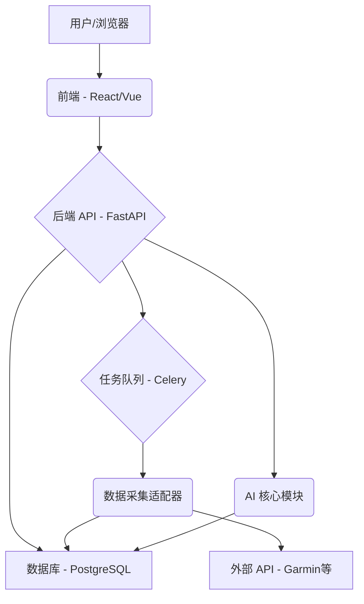

# 项目设计文档 (Project Design Document)

本文档详细记录 Sunya 项目的设计决策、系统架构、核心功能规格和技术选型。

## 核心需求概述

项目旨在通过采集用户的多维度数据，利用 AI 分析并以"空性"视角（客观、非情绪化、引导观察）与用户交互，帮助用户更好地理解自身。

主要分为两大业务模块：
1.  **数据准备:** 对接各类数据源（如健康设备、App API），实现自动化、标准化数据采集。
2.  **用户与 AI 交互:** 提供界面（聊天、数据展示、主动通知）让用户与"空性的我"互动。

## 技术架构与选型 (v1 - 2025-04-04)

### 整体架构

采用前后端分离架构，包含以下核心组件：

*   **前端:** 用户界面，负责展示和交互。
*   **后端 API:** 核心业务逻辑，提供接口，编排任务。
*   **数据采集模块:** 通过适配器模式对接第三方 API，标准化数据。
*   **数据库:** 存储用户信息、授权 Token、标准化健康数据等。
*   **AI 核心:** 数据分析、模式识别、生成"空性"解读。
*   **任务队列:** 处理异步、耗时任务（如数据拉取）。

### 技术选型

| 组件             | 选用技术                               | 主要理由                                                                 |
| ---------------- | -------------------------------------- | ------------------------------------------------------------------------ |
| 后端 API         | Python (FastAPI)                       | 高性能，异步支持，自动文档，Python 在 AI/数据处理方面的强大生态         |
| 数据库           | PostgreSQL                             | 功能强大，稳定可靠，支持 JSONB，适合结构化和半结构化数据存储               |
| 前端             | React / Vue (待定)                     | 成熟的现代 JS 框架，社区庞大，生态丰富，适合构建交互式界面               |
| 任务队列         | Celery + Redis/RabbitMQ                | Python 生态常用方案，稳定可靠，用于处理后台任务                           |
| 数据采集         | Python (内置于后端或独立服务)        | 利用 Python 的请求库和异步能力，适配器模式保证扩展性                    |
| AI 核心          | Python (Pandas, Scikit-learn, etc.)    | 充分利用 Python 的数据科学和机器学习库进行分析和建模                     |

### 数据源策略

*   **起点:** 以**运动手表/手环**数据为起点，优先实现 **Garmin API** 对接。
*   **扩展性:** 采用**适配器模式 (Adapter Pattern)** 设计数据采集模块，为未来接入 Apple HealthKit, Google Fit 等平台预留接口和统一数据模型。

*(此文档将在项目进展中逐步填充)* 